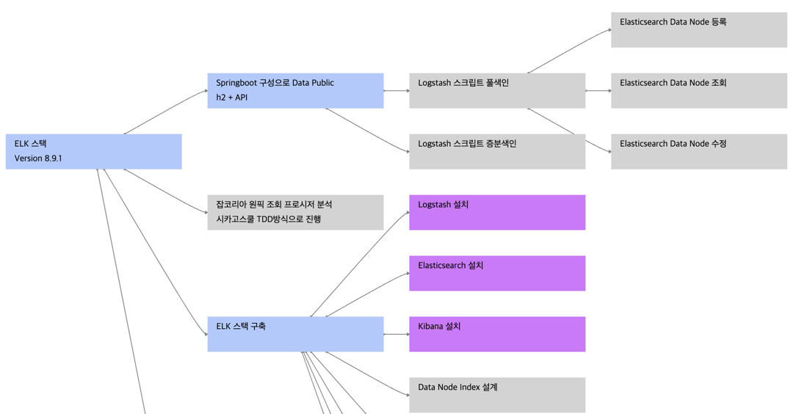

# With Springboot Elasticsearch Client 
- Springboot to Logstash
- Springboot for Elasticsearch Client

# 분석 마인드맵


```text
https://www.knotend.com/g/a#N4IgzgpgTglghgGxgLwnARgiAxA9lAWxAC5QA7XAEwjBPIHYAWADgE56OBGOkBDCBCRABRADIBpAASASocC7C5IA6ZAGrQwMXGUnMAdKx3cANCADGuBPiGYArhBABfY2QBsABlaMATAFZW3nnzoAkIAygAOsGQA5ui4uAAukoA2tYCMg4A844A6HZIAInDxcJIACtaYMCZKABaekgDUkgCChQCSIMZmFlBWCLYOTs6s7vSc3tykvPyCxCCAheOAKvOANZ2AIqOSgAtjgLyrkoAOE4Axa5KAIKsZgDtDgAATkoAhvYC4g0qHgC5zgAc10oAX85IAKtnZgJQ9gLtDmZKAI5OASNXWqZzJYplEoHAAJ69EBkLwAZm8jHozHoAQmQjEUjkyUAqbPA9pgkA2OyOOHMbzOTicZicZwYoKTEDhSIxOKJVK-EJoKAmCqSHlQABu0GSKUJoM64MhMPJZE4rE4rmG9FYjOCU1EuCiYHyYAF0kANguAXs7AB1LkkAASuASYHAB7jko6Qgh0NhZHork8zgRjH6GuZ2t1+sNpotgFzJs52h3E51ypye5zebyuNh+oQBvVwA2SQAkg4ANOaj0pAYWsUDCWFdTF8wwR6LGgU1Ij4erKkDgfIFeYLQmLpfL8oRA+Yzh86rrmKm4hg6DgZAKnbaUu7JbLZL6CM4jFY-VroHrzNy+UkADkqBBJE0yNQAB45wAjNV2ZS7+yMPOwEampgeCifqJJABVdgATTYADIuAIOdOa5pIJjQBA6BQLglTxPEYRgMQAD0qFRDA8QVCUOhmAQqEIAQEBkBAqBgKhUFQDBcGodRWCZjQD4gDGrqeAMjDeJ4zCeB+ICAKhrgA7C4AMYPnBcgAMdce+AwMxrHyswjCuEiniuHxgCbzYAGuOAC2jgA1A4AIBOSIAM52ACct4mybKFaMCw9CeIw75jkyQiABzdgAJ44AL6OCvEbKvLgADWJEoGK2aAKgT5lPk4KJ+Apw58QAEjAUQCqIECiggkgAMJICRiRKKyMDRDkeQFBe15bLsjQtAujqPrGcJIj6rjOApcUJUlKUCBlWVkDlZB5QVX7npeEA3oAGEPBQ0zRhbVLj0EmnBqqMu7jo2mbxC2vL8oVh4-megCPLYAuh1Ta6zBIuu7jMHxwhNmtJitu2W3fqeZVHfKarOMOnCepd13rW2m0DTtkhjS95IQJQURMcQADaUNwkwbAcEMwIuO4Xi+P4AC6hiw26LDsFwyP9IMwzcFjOPw-jSMRZ49WouiZNw3jiNGBSVI0nSDIMyjHgjv4TiKsqqrqlzbg8+jyPup63q+lziLInTyPxomybC9jcJyyiaIS5xSreDWICyzT8ta04A4IkOI4G2r8JG5r6JrhuW7sFbOMawrpsvpu9DvobtMm3C7GuJx3G8b7xv2xSinKapYd29r1m2T71uUtStL0sjkXeNFofJ2zacMh7DVNYwLtwgLKreGqhOzSqC2lwqSoV1XTgnXryqsBdXPl0LEtbh9X0Yxj5JQQgCAAOowJQ2EkLZrhtAICCxRArXxCQLDz6PhRwJQlD5VEJBIk4p4APJQNQbIkOTTME30qO84TAzsCTGe2+7rOpxzyPd5X6pOJLXo+l-gHd6ysUx-x1tWCOZAzYW18ITdcm5tzIyRIqL2744wcS4jxZGCklJcVUuAhOdkM5qizj6Xihc3DF2rnNOuLdTrtwun-PunhPqc3sEAA
```

# 설명