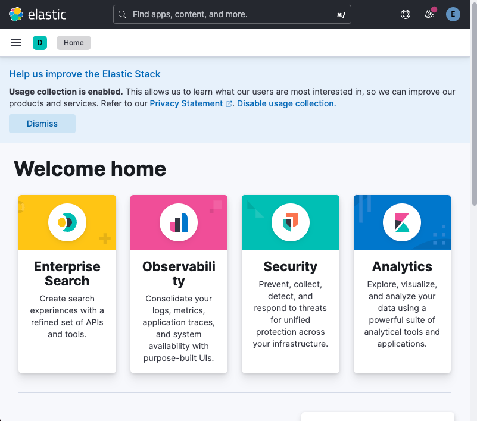

# With Springboot Elasticsearch Client 
- Springboot to Logstash
- Springboot for Elasticsearch Client

# 분석 마인드맵


```text
https://www.knotend.com/g/a#N4IgzgpgTglghgGxgLwnARgiAxA9lAWxAC5QA7XAEwjBPIHYAWADgE56OBGOkBDCBCRABRADIBpAASASocC7C5IA6ZAGrQwMXGUnMAdKx3cANCADGuBPiGYArhBABfY2QBsABlaMATAFZW3nnzoAkIAygAOsGQA5ui4uAAukoA2tYCMg4A844A6HZIAInDxcJIACtaYMCZKABaekgDUkgCChQCSIMZmFlBWCLYOTs6s7vSc3tykvPyCxCCAheOAKvOANZ2AIqOSgAtjgLyrkoAOE4Axa5KAIKsZgDtDgAATkoAhvYC4g0qHgC5zgAc10oAX85IAKtnZgJQ9gLtDmZKAI5OASNXWqZzJYplEoHAAJ69EBkLwAZm8jHozHoAQmQjEUjkyUAqbPA9pgkA2OyOOHMbzOTicZicZwYoKTEDhSIxOKJVK-EJoKAmCqSHlQABu0GSKUJoM64MhMPJZE4rE4rmG9FYjOCU1EuCiYHyYAF0kANguAXs7AB1LkkAASuASYHAB7jko6Qgh0NhZHork8zgRjH6GuZ2t1+sNpotgFzJs52h3E51ypye5zebyuNh+oQBvVwA2SQAkg4ANOaj0pAYWsUDCWFdTF8wwR6LGgU1Ij4erKkDgfIFeYLQmLpfL8oRA+Yzh86rrmKm4hg6DgZAKnbaUu7JbLZL6CM4jFY-VroHrzNy+UkADkqBBJE0yNQAB45wAjNV2ZS7+yMPOwEampgeCifqJJABVdgATTYADIuAIOdOa5pIJjQBA6BQLglTxPEYRgMQAD0qFRDA8QVCUOhmAQqEIAQEBkBAqBgKhUFQDBcGodRWCZjQD4gDGrqeAMjDeJ4zCeB+ICAKhrgA7C4AMYPnBcgAMdce+AwMxrHyswjCuEiniuHxgCbzYAGuOAC2jgA1A4AIBOSIAM52ACct4mybKFaMCw9CeIw75jkyQiABzdgAJ44AL6OCvEbKvLgADWJEoGK2aAKgT5lPk4KJ+Apw58QAEjAUQCqIECiggkgAMJICRiRKKyMDRDkeQFBe15bLsjQtAujqPrGcJIj6rjOApcUJUlKUCBlWVkDlZB5QVX7npeEA3oAGEPBQ0zRhbVLj0EmnBqqMu7jo2mbxC2vL8oVh4-megCPLYAuh1Ta6zBIuu7jMHxwhNmtJitu2W3fqeZVHfKarOMOnCepd13rW2m0DTtkhjS95IQJQURMcQADaUNwkwbAcEMwIuO4Xi+P4AC6hiw26LDsFwyP9IMwzcFjOPw-jSMRZ49WouiZNw3jiNGBSVI0nSDIMyjHgjv4TiKsqqrqlzbg8+jyPup63q+lziLInTyPxomybC9jcJyyiaIS5xSreDWICyzT8ta04A4IkOI4G2r8JG5r6JrhuW7sFbOMawrpsvpu9DvobtMm3C7GuJx3G8b7xv2xSinKapYd29r1m2T71uUtStL0sjkXeNFofJ2zacMh7DVNYwLtwgLKreGqhOzSqC2lwqSoV1XTgnXryqsBdXPl0LEtbh9X0Yxj5JQQgCAAOowJQ2EkLZrhtAICCxRArXxCQLDz6PhRwJQlD5VEJBIk4p4APJQNQbIkOTTME30qO84TAzsCTGe2+7rOpxzyPd5X6pOJLXo+l-gHd6ysUx-x1tWCOZAzYW18ITdcm5tzIyRIqL2744wcS4jxZGCklJcVUuAhOdkM5qizj6Xihc3DF2rnNOuLdTrtwun-PunhPqc3sEAA
```

# ELK 설치

https://github.com/lswteen/docker-elk

2개 파일 참조
```text
.env 
docker-compose.yml

.env 파일에는 ELK에 해당하는 환경 변수 설정

id : elastic
pw : jk1234

```

## Elasticsearch
http://localhost:9200/


## Kibana
http://localhost:5601/app/home#/



## elastic Devtool Console
```sql
# Click the Variables button, above, to create your own variables.
GET ${exampleVariable1} // _search
{
  "query": {
    "${exampleVariable2}": {} // match_all
  }
}


GET .kibana_task_manager_8.9.1_001
{
  "query":{
    "match_all" : {}
  }
}


POST _analyze
{
  "tokenizer": "nori_tokenizer",
  "text": "대한민국은 민주공화국이다."
}


PUT /product_index
{
  "mappings": {
    "properties": {
      "productId": {
        "type": "long"
      },
      "name": {
        "type": "text"
      },
      "price": {
        "type": "double"
      }
    }
  }
}


POST /product_index/_bulk
{ "index": {} }
{ "productId": 1, "name": "Product 1", "price": 19.99 }
{ "index": {} }
{ "productId": 2, "name": "Product 2", "price": 29.99 }
{ "index": {} }
{ "productId": 3, "name": "Product 3", "price": 39.99 }
{ "index": {} }
{ "productId": 4, "name": "Product 4", "price": 49.99 }
{ "index": {} }
{ "productId": 5, "name": "Product 5", "price": 59.99 }
{ "index": {} }
{ "productId": 6, "name": "Product 6", "price": 69.99 }
{ "index": {} }
{ "productId": 7, "name": "Product 7", "price": 79.99 }
{ "index": {} }
{ "productId": 8, "name": "Product 8", "price": 89.99 }
{ "index": {} }
{ "productId": 9, "name": "Product 9", "price": 99.99 }
{ "index": {} }
{ "productId": 10, "name": "Product 10", "price": 109.99 }

GET /product_index/_search


GET /product_index/_search
{
  "query": {
    "match": {
      "name": "Product 1"
    }
  }
}

GET /product_index/_search
{
  "query": {
    "term": {
      "productId": 2
    }
  }
}

DELETE /product_index


```